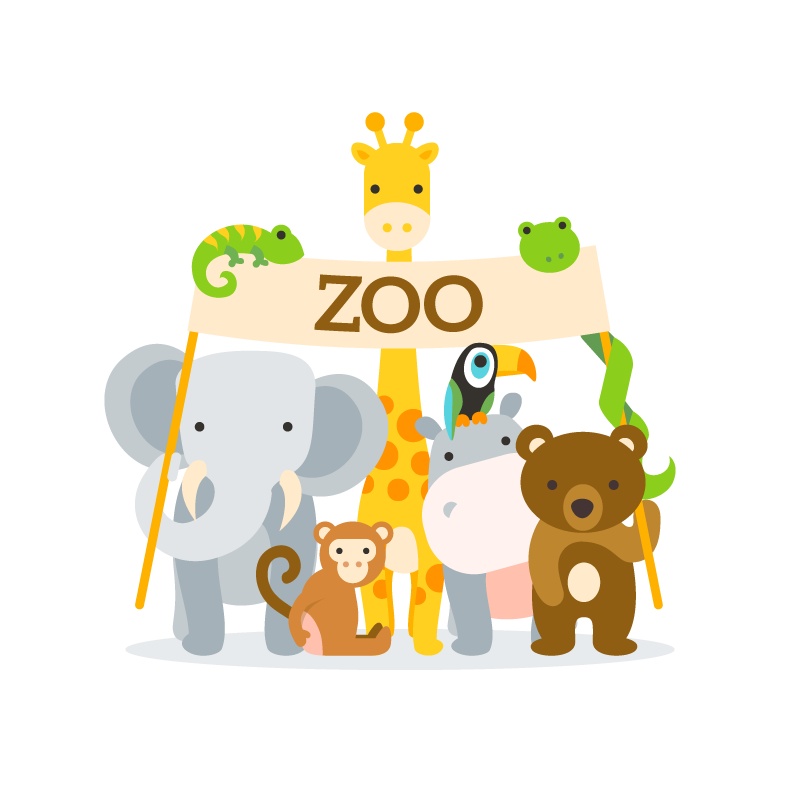

# Zoo Keeper API [](https://goreportcard.com/report/github.com/arthurdiegoo/ZooApi)


>This Project is a really simple boilerplate for GOlang beginners, aimed to help you create a really basic API with scalability. Use it to fit your own needs. The only package utilized for this was Mux.
---
**Technologies used:** 

* GO
* Mux

---
**Configuration:**

After cloning the respository, install the dependencies:

```
go install
```

Remember to clone the project utilizing Go, if you want it to be at your GOPATH directory.

I didn't used **Docker** to instantiate this go project, but you can do it if you don't want to have the whole environment locally at your machine, [Try it here!](https://www.docker.com/)

If you opt for docker, here's a handy page directed to GOlang releases: [Docker HUB](https://hub.docker.com/_/golang/)

---
**Usage:**

If you want to test using the same rest client i've used with my settings, you can click the button below:

[](https://insomnia.rest/run/?label=ZooKeeper%20API&uri=https%3A%2F%2Fraw.githubusercontent.com%2Farthurdiegoo%2FZooApi%2Fmaster%2Fassets%2Frest_client%2FInsomnia_2020-02-23.json)

To run any GO application you have two options: 

```
go build

.\zooapi.exe
```
or
```
go run .\main.go
```
